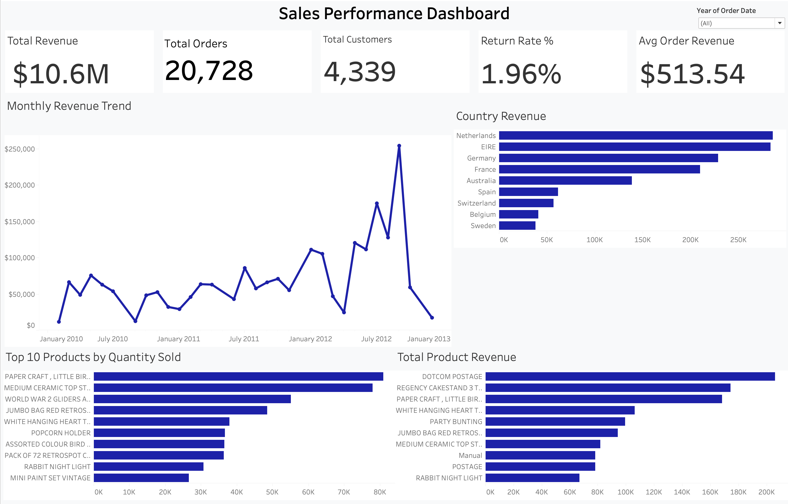

# Sales Performace Dashboard

## Overview
Designed an Interactice Tableau dashboard to analyze sales performance, customer metrics, and product revenue trends using KPI cards and interactive visualizations.

## KPIs
- Total Revenue
- Total Orders
- Total Customers
- Return Rate
- Average Order Revenue

## Dashboard Features
- Monthly revenue trend analysis
- Revenue by country
- Top-selling products
- Product revenue analysis
- Interactice year filter

## Tools Used
- Tableau Public
- SQL
- Excel

## Dashboard Preview

## Tableau Public Link
[View Interactive Dashboard](https://public.tableau.com/app/profile/brandon.martin.garcia/viz/SalesPerformanceDashboard_17807345547170/Dashboard1?publish=yes)

## Key Insights
- Revenue showed significant growth throughout 2012.
- The UK dominated overall sales, while Netherlands and EIRE were the strongest international revenue contributors. The UK was excluded from the country revenue chart to improve visibility into performance across smaller international markets.
- Several products consistently outperformed others in quantity sold.
- Return rate remained under 2%, indicating strong order quality.
